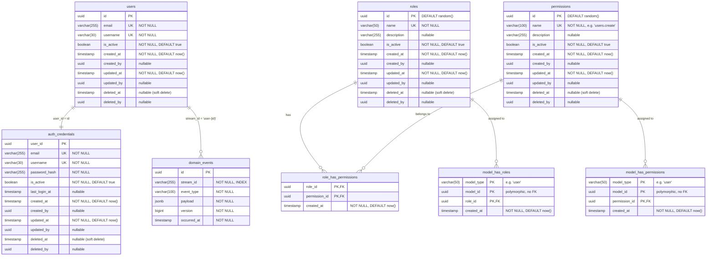

# Database Diagram

## Notes

- **users** — Read model projection of user aggregates. Denormalized for fast queries.
- **auth_credentials** — Stores login credentials (email, username, bcrypt hash). Separate from users for bounded context isolation (Auth vs User).
- **domain_events** — Event store. Each aggregate stream is identified by `stream_id` (e.g., `user-<uuid>`). Optimistic concurrency enforced via `UNIQUE(stream_id, version)`.
- **roles** — Named roles (e.g., `super-admin`, `editor`). Soft-deletable with audit columns.
- **permissions** — Dot-notation namespaced capabilities (e.g., `users.create`, `roles.read`). Soft-deletable with audit columns.
- **role_has_permissions** — Pivot table linking roles to permissions. Composite PK, no audit columns, hard-deleted.
- **model_has_roles** — Polymorphic pivot: assigns roles to any model type (currently `user`). `model_type` + `model_id` identify the entity. No FK on `model_id` — integrity enforced at app layer.
- **model_has_permissions** — Polymorphic pivot: assigns direct permissions to any model type. Same polymorphic pattern as `model_has_roles`.
- **Audit columns** (`created_at`, `created_by`, `updated_at`, `updated_by`, `deleted_at`, `deleted_by`) are shared across `users`, `auth_credentials`, `roles`, and `permissions` via `auditColumns` helper. Pivot tables only have `created_at`.
- **Soft deletes** — `deleted_at` marks records as deleted without removing them. All queries must filter `WHERE deleted_at IS NULL`.
